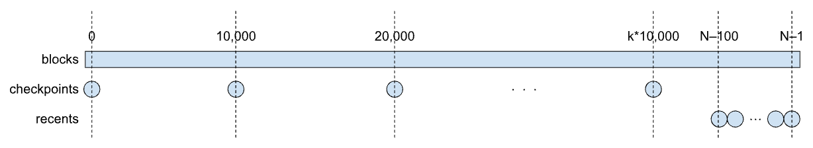

# snarkos-node-sync-locators

The `snarkos-node-sync-locators` crate provides _block locators_,
which are data structures used by nodes to advertise to other nodes the blocks in their possession,
which can be provided to other nodes to help the latter
sync their blockchain with the rest of the network.

In general, a block is uniquely identified by its height,
i.e. its position in the blockchain,
starting with 0 for the genesis block,
up to $N-1$ for the latest block,
if $N$ is the number of blocks in the blockchain.
A single block locator consists of a block height and a block hash;
the hash is conceptually redundant,
but it is used by nodes to check some level of consistency
among the block locators from different nodes.

The `BlockLocators` struct in this crate is a collection of block locators,
organized as two maps from block heights to block hashes:
a `checkpoints` map, and a `recents` map,
which can be illustrated as follows.

The rectangular bar represents the whole blockchain;
each circle represents a block locator.
See the documentation of `BlockLocators` for details.

Besides the `BlockLocators` struct,  this crate provides operations
to construct block locators,
to check them for well-formedness and consistency,
and to serialize and deserialize them to and from bytes.
